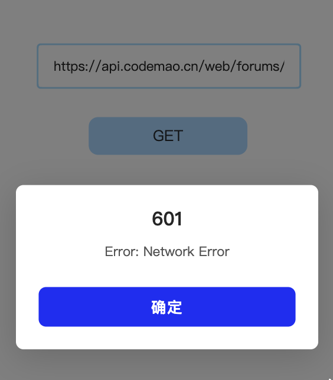

# CodemaoAPI_CFProxy
在Cloudflare上反向代理编程猫API服务

公共服务：[https://cmaproxy.pages.dev/](https://cmaproxy.pages.dev)

## 这是什么？

众所周知编程猫某个编辑器限制了所有发往 `api.codemao.cn` 的请求，为了保证开发者能更舒适的开发工具，故出此项目

当然，玩法不只是这一个

## 使用方法

将所有API的URL替换为自己部署的服务即可，这里使用公共服务演示：

原API地址：`https://api.codemao.cn/web/forums/notice-boards`

代理后的API地址：`https://cmaproxy.pages.dev/web/forums/notice-boards`

所有请求方式/Header都和请求官方API时一样，这个东西只不过就是为了骗过某些检测

## 截图

